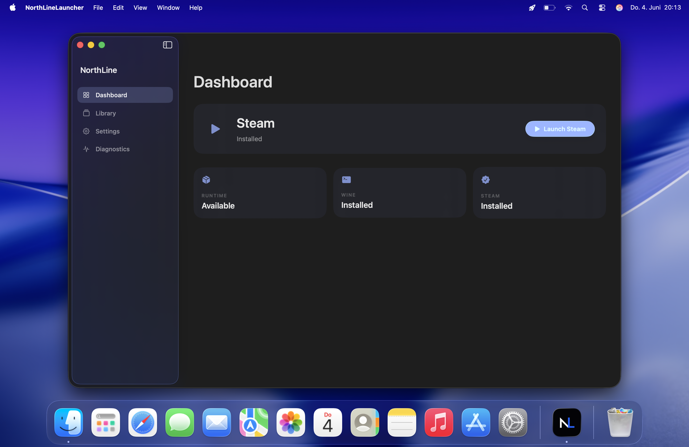

# NorthLine Launcher

Run Windows Steam. The Mac way.

NorthLine Launcher is a native SwiftUI macOS app focused on one job: making Windows Steam simple to launch and recover on Apple Silicon Macs.

The long-term goal is a complete one-click Steam setup. For the 0.9 Beta, users
must still provide a compatible Wine runtime themselves. Full one-click runtime
installation is planned for future updates.

## Screenshots

### Dashboard



## Beta Status

Current release target: **NorthLine Launcher 0.9 Beta**

This is a public beta candidate. Steam launch, login, game installation and game
launch have been verified locally, but broader hardware and game compatibility
testing is still in progress.

Important for 0.9 Beta: Wine must be installed by the user before relying on the
launcher flow. NorthLine will keep improving runtime management, but the fully
automatic one-click experience is not part of this beta cut yet.

## What NorthLine Is

- A Steam-first launcher for Windows Steam on macOS
- A native macOS app built with SwiftUI
- A focused Steam launcher with runtime diagnostics and recovery tools
- A recovery-focused tool for users who should not need Terminal access

## What NorthLine Is Not

NorthLine Launcher is **not** trying to replace CrossOver.

CrossOver is a broad compatibility product for many Windows applications. NorthLine is intentionally narrower: it optimizes for the simplest possible Steam-first experience.

NorthLine does not currently target Epic Games, GOG, Battle.net, Ubisoft Connect or arbitrary Windows applications.

## Features

- Launch Windows Steam from a NorthLine-managed prefix
- Launch Steam from the native macOS app
- Launch installed Steam games
- Detect runtime, Wine, Steam, Rosetta, GPTK and DXVK status
- Maintain a dedicated runtime directory in Application Support
- Show recent runtime and installation logs
- Copy or export diagnostics for support
- Validate, repair or reset the managed Steam installation
- Apple Silicon-only build target

## Requirements

- Apple Silicon Mac
- macOS 15 Sequoia or newer
- Network access for runtime and Steam downloads
- Rosetta available on the system
- A compatible Wine installation provided by the user
- A Steam account
- Apple Game Porting Toolkit 3.0 disk image available when runtime setup requires it

NorthLine stores its managed files under:

```text
~/Library/Application Support/NorthLineLauncher/
```

Managed subdirectories:

```text
Downloads/
Runtime/
Steam/
Prefixes/
Logs/
```

## Apple Silicon Support

NorthLine is made for Apple Silicon and builds for `arm64`.

The runtime layer is designed around Apple Silicon Macs and macOS Tahoe. Intel Macs are not a supported beta target.

## Troubleshooting

Open **Diagnostics** inside the app first. It shows:

- Platform support
- Rosetta status
- Wine status
- Steam status
- Runtime directory status
- Steam installer status
- GPTK status
- DXVK status
- Recent logs

Useful actions:

- **Refresh status** updates all checks.
- **Copy diagnostics** copies a redacted support report.
- **Copy logs** copies recent logs.
- **Export** saves a diagnostics report to a text file.

Open **Settings > Maintenance** for recovery:

- **Validate** checks runtime and Steam health.
- **Repair** rebuilds the managed runtime pieces needed for Steam.
- **Reset Steam** removes the managed Steam prefix and Steam directory while keeping runtime downloads and logs.

## Known Issues

- Game compatibility varies by title.
- The beta currently focuses only on Windows Steam.
- Wine must be installed by the user for 0.9 Beta.
- Full one-click runtime installation is planned for future updates.
- GPTK availability depends on the user having access to Apple's Game Porting Toolkit.
- The app is not notarized until the release signing pipeline is completed.
- Some Steam UI behavior may depend on Wine/GPTK updates.

## FAQ

### Does NorthLine install macOS Steam?

No. NorthLine installs and launches the Windows version of Steam in a managed runtime.

### Do I need to know Wine?

For 0.9 Beta, you need a compatible Wine installation available on your Mac.
NorthLine still handles the Steam-focused launcher flow and diagnostics, but
fully automatic one-click runtime setup is planned for a future update.

### Can I use Epic Games or Battle.net?

No. The beta is Steam-only.

### Is this a CrossOver replacement?

No. CrossOver is a broad Windows app compatibility product. NorthLine is a focused Steam launcher.

### Where are logs stored?

```text
~/Library/Application Support/NorthLineLauncher/Logs/
```

You can also copy or export diagnostics from inside the app.
