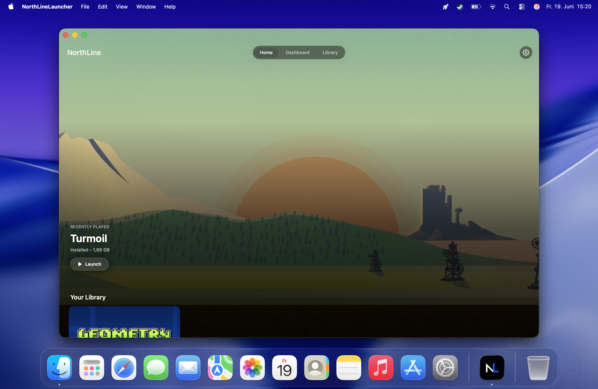

# NorthLine Launcher

Run Windows Steam. The Mac way.

NorthLine Launcher is a native SwiftUI macOS app with one job: making Windows Steam simple to run on Apple Silicon Macs. No Terminal. No manual setup. Just launch.

## Screenshots

### Home



## What's New in v1.0

NorthLine Launcher is now out of beta. v1.0 ships the most-requested feature from the community: **fully automatic Wine and Game Porting Toolkit installation** — no Terminal, no manual downloads, no Apple ID login required.

Hit "Install Wine & GPTK" once. NorthLine handles everything in the background.

## What NorthLine Is

- A Steam-first launcher for Windows Steam on Apple Silicon Macs
- A native macOS app built with SwiftUI and Apple's Liquid Glass design system
- A focused Steam launcher with runtime diagnostics and recovery tools
- A tool built for users who should never need to touch Terminal

## What NorthLine Is Not

NorthLine Launcher is **not** trying to replace CrossOver.

CrossOver is a broad compatibility product for many Windows applications. NorthLine is intentionally narrower: it optimizes for the simplest possible Steam-first experience on Apple Silicon.

NorthLine does not target Epic Games, GOG, Battle.net, Ubisoft Connect, or arbitrary Windows applications.

## Features

- **One-click Wine & GPTK installation** — Homebrew is bootstrapped silently if missing, GPTK is installed via Gcenx's maintained formula, all in-app with a step-by-step progress view
- Launch Windows Steam from a NorthLine-managed prefix
- Launch installed Steam games directly from the app
- Full-bleed home screen showing your most recently played game
- Detect runtime, Wine, Steam, Rosetta, GPTK and DXVK status
- Maintain a dedicated runtime directory in Application Support
- Show recent runtime and installation logs
- Copy or export diagnostics for support
- Validate, repair or reset the managed Steam installation
- Apple Silicon-only build target

## Requirements

- Apple Silicon Mac
- **macOS Tahoe (26) or newer** — NorthLine is built entirely on Tahoe's native Liquid Glass APIs. Sonoma and Sequoia are not supported and will not be added.
- Network access for runtime and Steam downloads
- Rosetta available on the system
- A Steam account

> Wine and GPTK are installed automatically by NorthLine. No manual setup required. On a completely fresh Mac without Homebrew, NorthLine will prompt for administrator access once during the initial Homebrew setup — this is a one-time step.

NorthLine stores its managed files under:

```text
~/Library/Application Support/NorthLineLauncher/
```

Managed subdirectories:

```text
Downloads/
Runtime/
Steam/
Prefixes/
Logs/
```

## Apple Silicon Support

NorthLine is built for Apple Silicon and compiles for `arm64` only. Intel Macs are not a supported target.

## Troubleshooting

Open **Diagnostics** inside the app first. It shows:

- Platform support
- Rosetta status
- Wine status
- Steam status
- Runtime directory status
- Steam installer status
- GPTK status
- DXVK status
- Recent logs

Useful actions:

- **Refresh status** updates all checks.
- **Copy diagnostics** copies a redacted support report.
- **Copy logs** copies recent logs.
- **Export** saves a diagnostics report to a text file.

Open **Settings > Maintenance** for recovery:

- **Validate** checks runtime and Steam health.
- **Repair** rebuilds the managed runtime pieces needed for Steam.
- **Reset Steam** removes the managed Steam prefix and Steam directory while keeping runtime downloads and logs.

## Known Issues

- Game compatibility varies by title — broader compatibility testing is ongoing.
- The app focuses exclusively on Windows Steam.
- Some Steam UI behavior may depend on Wine/GPTK updates.
- The app is not notarized until the release signing pipeline is completed.

## FAQ

### Does NorthLine install macOS Steam?

No. NorthLine installs and launches the Windows version of Steam in a managed runtime.

### Do I need to install Wine myself?

No. NorthLine installs Wine and Game Porting Toolkit automatically in the background with a single tap. No Terminal, no Homebrew knowledge, no manual downloads required.

### Can I use Epic Games or Battle.net?

No. NorthLine is Steam-only by design.

### Is this a CrossOver replacement?

No. CrossOver is a broad Windows app compatibility product. NorthLine is a focused Steam launcher built for Apple Silicon.

### Where are logs stored?

```text
~/Library/Application Support/NorthLineLauncher/Logs/
```

You can also copy or export diagnostics from inside the app.

### Why is macOS Tahoe required?

NorthLine is built entirely on Apple's native Liquid Glass design system, which is exclusive to macOS Tahoe and newer. Supporting older macOS versions would require maintaining a separate, degraded UI — that's not a trade-off worth making.
